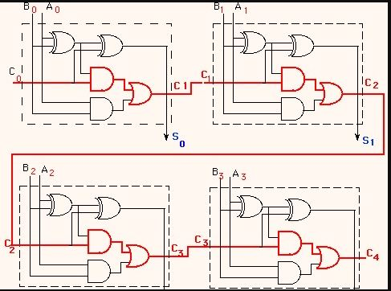

# Day 24

```

```

## algorithm

### part 1 

just implement the algorithm (hashsets/vectors/dequeue)

### part 2

The key to this one is to realize that this is a ripple carry adder circuit (shown below). Knowing this we can implement some rules to find the wrong wires. 

Despite the problem saying to swap the outputs of gates this is not actually needed. You only need to find the wrong gates, and sort them, to get the answer.

#### Rules

1. if there's a gate that's not an `XOR` going to `z` it's wrong
1. if there's an `XOR` that doesn't have `x` and `y` as an input and not `z` as an output or not `x` and not `y` as an input and `z` as an output it's wrong
1. all `AND` gates must go into an `OR` (except the first one which is a half adder because there is no carry bit)
1. if there's an `XOR` that goes to an `OR`, it's wrong



## notes/experimentation

